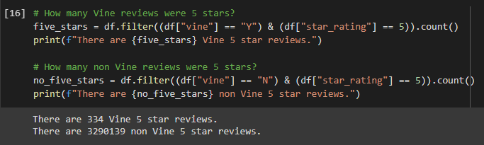

# Amazon Vine Analysis

## Overview of the Analysis

The task was to chose a dataset from the Amazon Vine program and use PySpark to perform the ETL process to extract the dataset, transform the data, connect to an AWS RDS instance, and load the transformed data into pgAdmin. Then using PySpark, determining if there is any bias toward favourable reviews from Vine members in the dataset. The dataset I used for this project was Music.

## Resources

- Data Source: https://s3.amazonaws.com/amazon-reviews-pds/tsv/amazon_reviews_us_Music_v1_00.tsv.gz
- Software: Google Colaboratory, pgAdmin4, Postgres, Atom 1.53.0 x64

## Results

#### Three Questions Answered:

**How many Vine reviews and non Vine reviews were there?**

- There were 1933 Vine reviews and 4,749,607 non Vine reviews in the dataset that contains 4,751,577 total reviews.

**How many Vine reviews were 5 stars? How many non Vine reviews were 5 stars?**

- There were 334 Vine 5 star reviews and 3,290,139 non Vine 5 star reviews in the dataset.

**What percentage of Vine reviews were 5 stars? What percentage of non Vine reviews were 5 stars?**

- The percentage of Vine reviews that were five start was 0.00703% and non Vine was 69%.

## Summary

I believe there might be some positivity bias happening in the non Vine 5 star reviews which came in at 69%. This is most likely due to the what is being bought which is Music. People tend to buy music based on their likes and tastes. This would create a positivity bias.

 A additional analysis that could be looked at is the age demographic of the buyers. This could also create a positivity bias based on the time of the music. Example being that younger people might be drawn more to new music and older people to older music.
